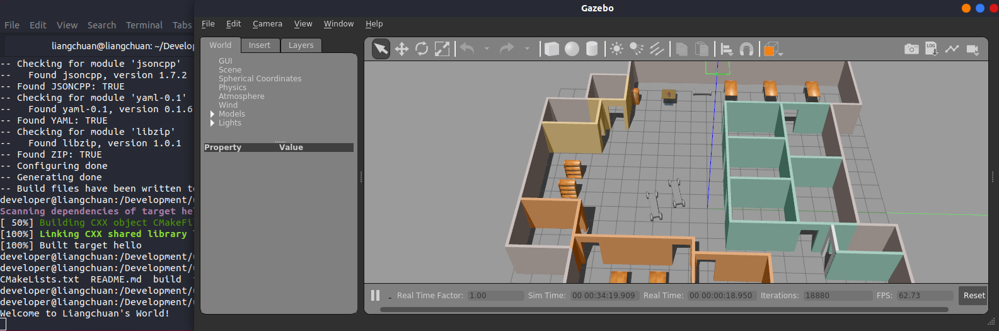

# BuildMyWorld
This is the code for my Udacity Robotics Software Engineer Nanodegree  - Build My World. It creates a simulation world with Gazebo.

### Directory Structure
```
    .Build_My_World               # main folder 
    ├── images                         # Gazebo world with plugin output image
    │   ├── Screenshot.png
    ├── model                          # Model files of the two-wheeled and four-wheel robots
    │   ├── mybuilding
    │   │   ├── model.config
    │   │   ├── model.sdf
    │   ├── robot                      # The four-wheel robot
    │   │   ├── model.config
    │   │   ├── model.sdf
    │   ├── robot1                     # The two-wheel robot
    │   │   ├── model.config
    │   │   ├── model.sdf
    ├── script                         # Gazebo World plugin C++ script
    │   ├── hello.cpp
    ├── world                          # Gazebo main World containing models
    │   ├── myworld
    ├── CMakeLists.txt
    └── README.md
```

### Steps to launch the simulation

#### Clone the project folder in /home/workspace/
```sh
$ cd /home/workspace/
$ git clone git@github.com:glc12125/udacity_robotics.git
```

#### Compile the code
```sh
$ cd /home/workspace/udacity_robotics/BuildMyWorld
$ mkdir build
$ cd build/
$ cmake ../
$ make
```

#### Add the library path to the Gazebo plugin path  
```sh
$ export GAZEBO_PLUGIN_PATH=${GAZEBO_PLUGIN_PATH}:/home/workspace/udacity_robotics/BuildMyWorld/build
```

#### Run the Gazebo World file  
```sh
$ cd /home/workspace/udacity_robotics/BuildMyWorld/world/
$ gazebo myworld
```

### Output
A welcome message **Welcome to Liangchuan's World!** is printed and the Building, mybuilding and robots are displayed inside a Gazebo World. An example is as following:

