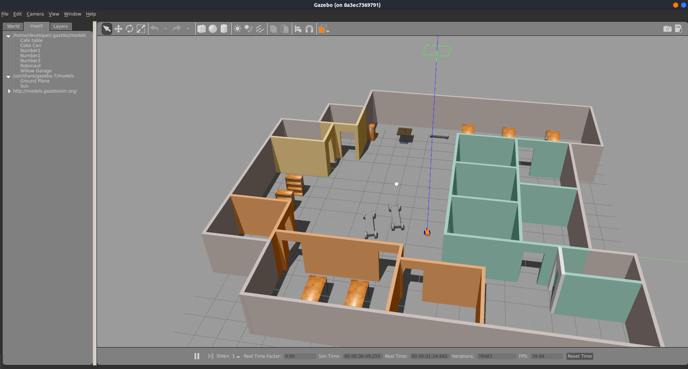
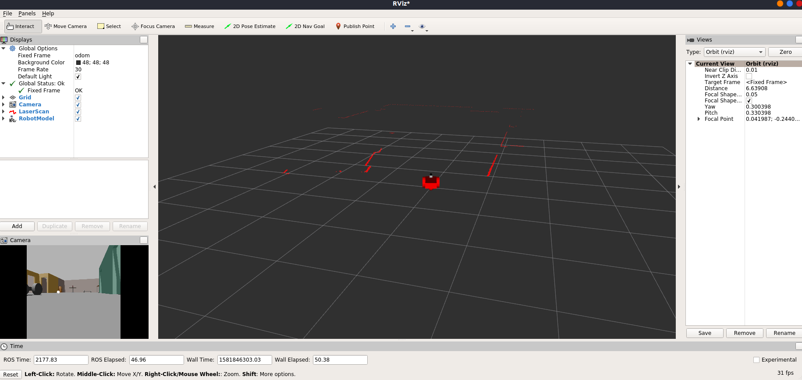

# GoChaseIt!
This is the code for my Udacity Robotics Software Engineer Nanodegree  - GoChaseIt!. It creates a simulation world with Gazebo and services to chase a pure white ball.

### Directory Structure
```
    GoChaseIt                         # main folder 
    ├── images                         # Gazebo world with plugin output image
    │   ├── rviz.png                   # Example rviz screen
    │   ├── gazebo.png                 # Example gazebo world
    │   ├── gochaseit.gif              # ball_chaser code in action
    ├── my_robot                       # my_robot contains world files, launch files and relevant resources
    │   ├── launch
    │   │   ├── robot_description.launch
    │   │   ├── world.launch           # The entry point launch file for myworld
    │   ├── meshes                     # Gazebo provided meshes
    │   │   ├── hokuyo.dae             # hokuyo lidar mesh file
    │   ├── urdf                       # robot description files
    │   │   ├── my_robot.gazebo        # plugin definitions
    │   │   ├── my_robot.xacro         # main URDF file
    │   ├── world                          # Gazebo main World containing models
    │   │   ├── my_ball                    # Pure white ball model folder
    │   │   ├── myworld.world              # The main world file
    │   ├── CMakeLists.txt
    ├── ball_chaser                    # ROS services for simple white ball recognition and robot control
    │   ├── launch
    │   │   ├── ball_chaser.launch     # The entry point launch file for drive_got and process_image services
    │   ├── src                        
    │   │   ├── drive_bot.cpp          # service to send command to control the robot
    │   │   ├── process_image.cpp      # Naive implementation for recognizing pure white ball and send control signals
    │   ├── srv                       
    │   │   ├── DriveToTarget.srv      # Definition for service data type
    │   ├── CMakeLists.txt
    │   ├── package.xml
    └── README.md
```

### Steps to launch the simulation

#### Clone the project folder in /home/workspace/
```sh
$ cd /home/workspace/
$ git clone git@github.com:glc12125/udacity_robotics.git
```

#### Compile the code
```sh
create two package in your catkin workspace to host ball_chaser and my_robot with the same names 
$ cd /home/workspace/udacity_robotics/GoChaseIt
$ cp -r ball_chaser ${your_catkin_ws}/src
$ cp -r my_robot ${your_catkin_ws}/src
update the path in line 6608 of GoChaseIt/my_robot/world/myworld.world to ${your_catkin_ws}/src/my_robot/meshes/hokuyo.dae
$ cd ${your_catkin_ws}
$ source devel setup.bash
$ catkin_make
```

Note: gzserver will fail to load if the path is incorrect

#### Run the Gazebo World file  
```sh
$ cd ${your_catkin_ws}
$ roslaunch my_robot world.launch
```

In another commandline window

```sh
$ cd ${your_catkin_ws}
$ roslaunch ball_chaser ball_chaser.launch
```

### Output
You should expect two new windows: the gazebo world and rviz window. For the my_robot launch, you need to add views for Camera, Laserscan and RobotModel in rviz for visualization. After proper configuration, you should see something similar to the following:

Gazebo world:


Rviz


For the ball_chaser launch, you should see the robot starting moving towards the white ball, which is located in the view of the robot initially. You can move the ball around in the Gazebo world to test if the robot will follow the ball. You should expect something like the following demo:

